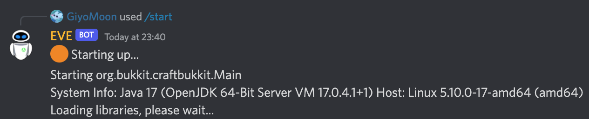

EVE lets you control a Minecraft server through Discord. It routes everything from the server `stdout/stderr` to a Discord channel and receives `stdin` commands from Discord and routes them back to the server instance.


## Configuration
To run EVE, you need to set up a few environment variables:

- `DISCORD_TOKEN`: The token of you Discord bot
- `CONSOLE_CHANNEL_ID`: The the ID of the Discord channel which should be used as the console. EVE will pass every output from the server into this channel
- `SERVER_JAR_PATH`: Path to the server executable. E.g. `/srv/server/server.jar`
- `SERVER_MEMORY`: Memory in megabytes to assign to the minecraft server. E.g `6144`
- `MAX_PLAYERS`: (Optional) Max players of your minecraft server. This is only used for the bot presence and if not provided, it won't show the player count there.
- `JVM_FLAGS`: (Optional) Additional jvm flags to pass to the server instance
- `AUTO_ACCEPT_EULA`: (Optional) If the EULA should be accepted automatically
- `RUST_LOG`: (Optional) Rust log level (Does not affect the server output). Set it to `info` to recieve all information or to `warn` if you just want to receive warnings/errors.

## Running
There are multiple ways to run EVE:
### Docker
The most convenient way is to run it in a Docker container. EVE gets automatically builded and deployed on [Github Packages](https://github.com/GiyoMoon/EVE/pkgs/container/eve) and can be pulled from there.

**Note**: The server is run as a non-root user. You may need to change the permissions of your server folder.

Example run command:
```bash
docker run -d -p 25565:25565 -e RUST_LOG=info -e DISCORD_TOKEN=YOUR_BOT_TOKEN -e CONSOLE_CHANNEL_ID=YOUR_CHANNEL_ID -e SERVER_JAR_PATH=/eve/server/server.jar -e SERVER_MEMORY=6144 -e MAX_PLAYERS=5 -e AUTO_ACCEPT_EULA=1 -v /srv/server:/eve/server --name EVE ghcr.io/giyomoon/eve:java17
```
Additional ports can be mapped if you are running a dynmap for example.

**Java version**

EVE gets build for three different Java versions. Java 17, 11 and 8. Depending on the version/type of your Minecraft server, you need to choose the correct version for you.

- `Java 17`: `java17` (`ghcr.io/giyomoon/eve:java17`)
- `Java 11`: `java11` (`ghcr.io/giyomoon/eve:java11`)
- `Java 8`: `java8` (`ghcr.io/giyomoon/eve:java8`)

### Service
It's also possible to directly use the executable and create a system service. There are pre built binaries under the [Releases](https://github.com/GiyoMoon/EVE/releases), but feel free to build EVE for yourself :)
```bash
sudo touch /etc/systemd/system/eve.service
```
Insert this content:
```
[Unit]
Description=EVE
Wants=network-online.target
After=network-online.target

[Service]

# Use a non-root user
User=eve
Group=eve

ExecReload=/bin/kill -HUP $MAINPID
# Path to the executable
ExecStart=/srv/eve
KillMode=process
KillSignal=SIGINT
LimitNOFILE=65536
LimitNPROC=infinity
Restart=on-failure
RestartSec=2

Environment="RUST_LOG=info"
Environment="DISCORD_TOKEN=YOUR_BOT_TOKEN"
Environment="CONSOLE_CHANNEL_ID=YOUR_CHANNEL_ID"
Environment="SERVER_JAR_PATH=/srv/server/server.jar"
Environment="SERVER_MEMORY=6144"
Environment="MAX_PLAYERS=5"
Environment="AUTO_ACCEPT_EULA=1"

[Install]
WantedBy=multi-user.target
```
**Note**: In this example I configured the service to run as the user `eve`. It's best practice to never run a minecraft server as root. Make sure your user has permission to execute the executable and access the server folder.

Now, start the service:
```bash
sudo systemctl enable eve.service
sudo systemctl start eve.service
```
